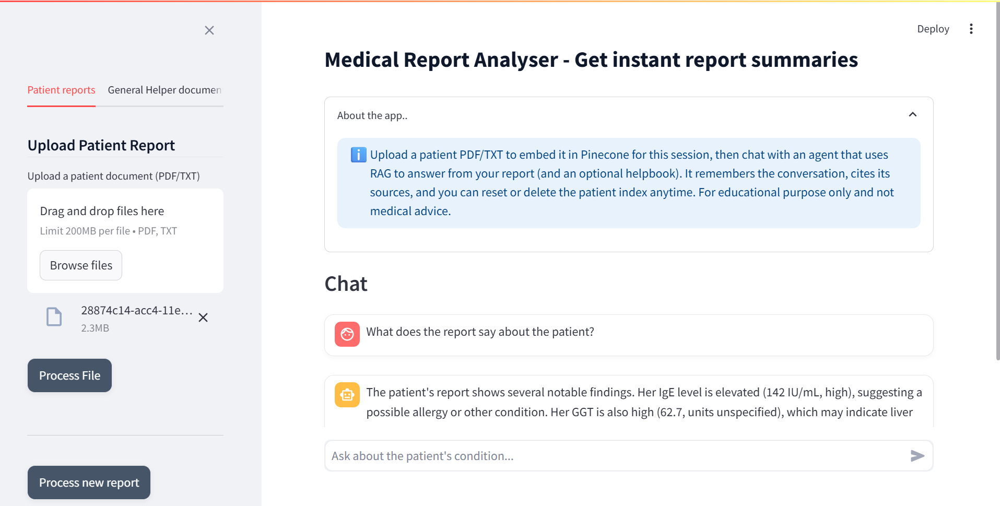
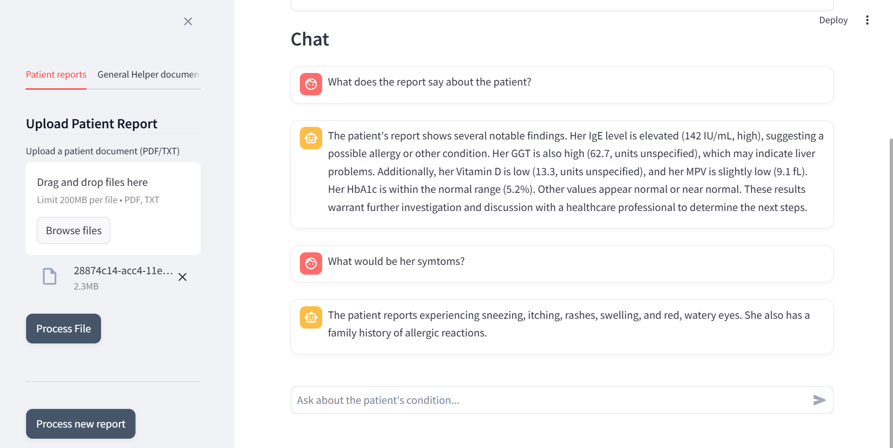
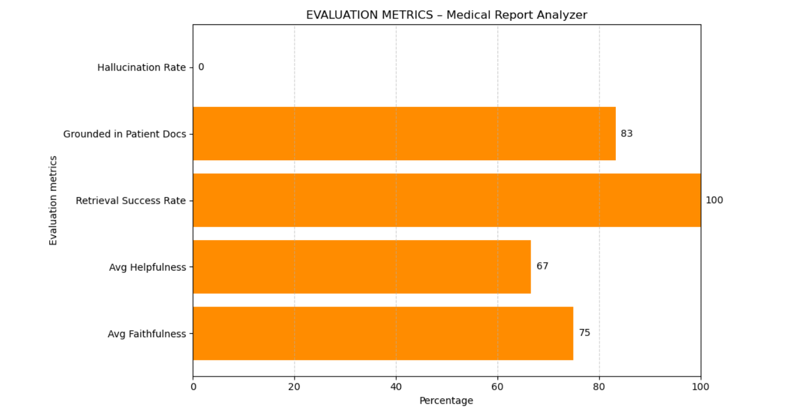

# 🧠 AI Medical Report Analyser – RAG-powered Clinical Assistant  

[](https://www.python.org/)  [](https://www.langchain.com/)  [](https://www.pinecone.io/)  [](https://ai.google.dev/gemini-api)  [](https://streamlit.io/)  [](LICENSE)  

---

## 📑 Table of Contents
- [Introduction](#-introduction)
- [Objectives](#-objectives)
- [Methodology](#-methodology)
- [Demo](#demo)
- [Evaluation](#-evaluation)
- [Workflow](#-workflow)
- [Features](#-features)
- [Technologies Used](#-technologies-used)
- [Installation](#-installation)
- [Future Scope](#-future-scope)
- [Authors](#-authors)
- [References](#-references)

---

## 📖 Introduction  
Healthcare generates vast amounts of unstructured clinical data. Interpreting **patient medical reports** can be time-consuming and confusing for non-specialists. Large Language Models (LLMs) are powerful at text synthesis but prone to **hallucination** when used without grounding.  

This project builds a **Retrieval-Augmented Generation (RAG)** assistant that ensures **trustworthy, cited answers** to patient queries. By embedding both **reference helper documents** and **patient PDFs**, the system retrieves relevant evidence before passing it to an LLM (Gemini 1.5 Flash). The result is a **transparent and educational chatbot** that can summarise, interpret, and explain medical reports.  

⚠️ *Disclaimer: This project is for educational use only. It is not a medical diagnostic tool.*  

---

## 🎯 Objectives  
- Provide **faithful, source-grounded answers** based on patient data.  
- Ensure **traceability** by citing whether information came from `[patient]`, `[helpbook]`, or `[web]`.  
- Minimise hallucinations by enforcing retrieval-first prompting.  
- Build a **user-friendly Streamlit app** for uploads, chat, and metrics.  
- Support **evaluation metrics** (faithfulness, helpfulness, latency, hallucination rate).  

---

## 🔎 Methodology  

### 1. Document Ingestion  
- **Helper Docs**: Uploaded once (from `/helperDocs`) and stored persistently.  
- **Patient Reports**: Uploaded per session (PDF/TXT), split into 1000-char chunks with 150 overlap, tagged with `session_id`.  

### 2. Embedding & Storage  
- Embeddings: `MiniLM-L6-v2 (384-d)` from HuggingFace.  
- Storage: **Pinecone** vector database with two indexes:  
  - `GENERAL_INDEX` → helper docs  
  - `PATIENT_INDEX` → per-session patient docs  

### 3. Retrieval  
- Dual retriever using **Maximal Marginal Relevance (MMR)**:  
  - Helpbook: k=6, λ=0.2  
  - Patient: k=10, λ=0.35 (filtered by `session_id`)  
- If retrieval fails → fallback to **DuckDuckGo** search.  

### 4. RAG Generation  
- **Prompt template** ensures patient-first grounding and inline citations.  
- LLM: **Gemini 1.5 Flash** with `temperature=0.2`.  
- Conversation memory (`RunnableWithMessageHistory`) maintains context.  

### 5. Output  
- Streamlit chat displays concise 2–3 paragraph answers.  
- Each response includes:  
  - Key values & ranges  
  - Citations `[patient] [helpbook] [web]`  
  - Neutral explanatory tone  

---

## Demo 

 
 

---

## 📊 Evaluation  

The system tracks metrics per session:  
- **Faithfulness**: Percentage of answers supported by context  
- **Helpfulness**: Usefulness to the user  
- **Latency**: Retrieval, LLM, total  
- **Grounding rate**: How often answers cite patient/helpbook  
- **Hallucination rate**: Answers unsupported by context  

📈 Example chart:  
  

---

## 🖥️ Workflow  

  

*A simplified horizontal flow: UI → Ingestion & Embeddings → Pinecone → Retrieval → LLM → Answer (with DuckDuckGo fallback)*  

---

## ✨ Features  
- Upload & process **helper documents** once.  
- Upload **patient reports** per session.  
- Tools:  
  - `RAG_QA`: answer questions with citations  
  - `Summarise Patient Report`: concise report overview  
  - `Interpret Lab Test`: test-level explanations  
- **DuckDuckGo fallback** with explicit `[web]` labels.  
- Automatic metrics logging to `session_metrics.csv`.  

---

## 🛠️ Technologies Used  
- **Streamlit** – interactive UI  
- **LangChain** – RAG orchestration  
- **HuggingFace Embeddings** – MiniLM-L6-v2  
- **Pinecone** – vector store  
- **Google Gemini 1.5 Flash** – LLM generation  
- **DuckDuckGo API** – fallback web search  

---

## ⚙️ Installation  

```bash
git clone https://github.com/ACM40960/project-ai-medical-report-analyser.git
cd project-ai-medical-report-analyser

python -m venv venv
source venv/bin/activate  # Linux/Mac
venv\Scriptsctivate.ps1  # Windows

pip install -r requirements.txt
```

Set up `.env`:  
```ini
PINECONE_API_KEY=...
PINECONE_REGION=us-east-1
GENERAL_INDEX_NAME=medical-helpbook
PATIENT_INDEX_NAME=patient-reports
GOOGLE_API_KEY=...
```

Run locally:  
```bash
streamlit run app.py
```

---

## 📌 Future Scope  
- 🌍 Multilingual and speech-enabled interface  
- 🧑‍⚕️ Doctor co-pilot integrations  
- 📈 Visual dashboards for retrieval quality  
- 🔄 Reinforcement via user feedback

---

## 🧑‍💻 Authors  
- Sushmitha B (24209228)  
- Kritheshvar (24233914)

---

## 📚 References  
1. Lewis, P., et al. (2020). *Retrieval-augmented generation for knowledge-intensive NLP tasks.* NeurIPS. [Link](https://proceedings.neurips.cc/paper/2020/file/6b493230205f780e1bc26945df7481e5-Paper.pdf)  
2. Carbonell, J., & Goldstein, J. (1998). *The use of MMR, diversity-based reranking for reordering documents and producing summaries.* SIGIR. [Link](https://www.cs.cmu.edu/~jgc/publication/The_Use_MMR_Diversity_Based_LTMIR_1998.pdf)  
3. Chen, Y., et al. (2025). *MRD-RAG: Enhancing medical diagnosis with multi-round RAG.* arXiv. [Link](https://arxiv.org/html/2504.07724v1)  
4. Yang, R., et al. (2025). *RAG for generative AI in health care.* npj Health Systems. [Link](https://www.nature.com/articles/s44401-024-00004-1)  
